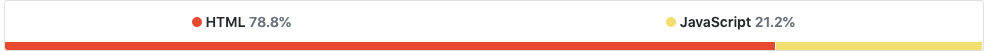
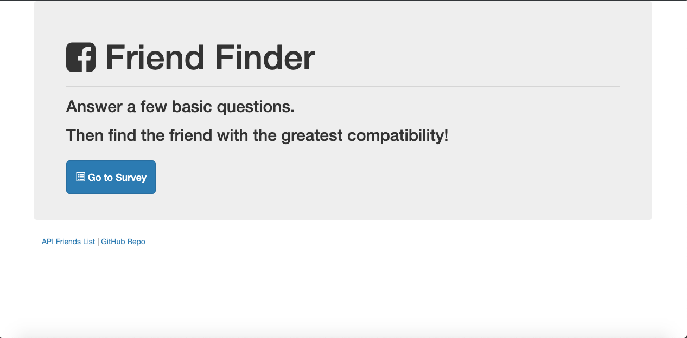
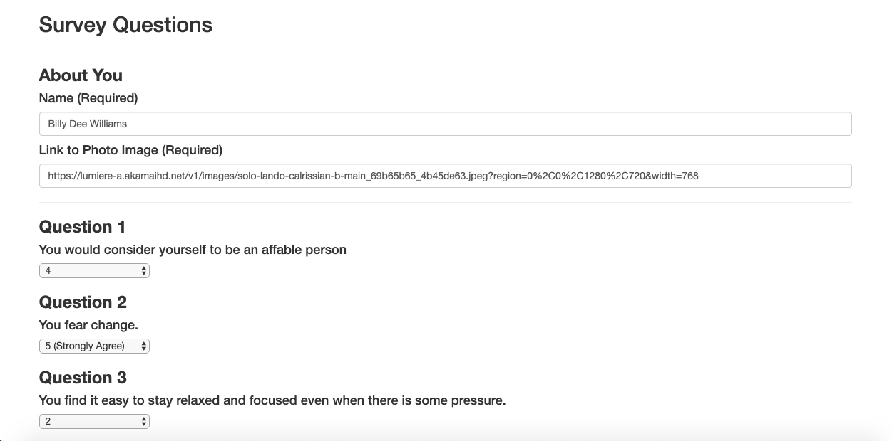
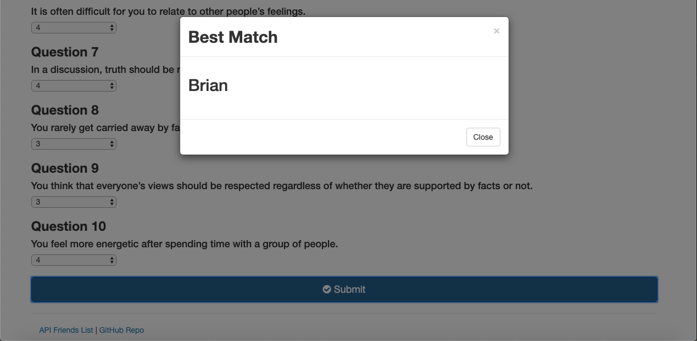
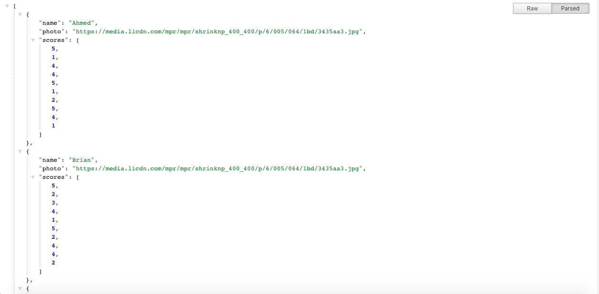

# FriendFinder

A compatibility-based "FriendFinder" application -- basically a dating app. This full-stack site will take in results from surveys, then compare their answers with those from other users. The app will then display the name and picture of the user with the best overall match.

[Heroku Deployment](https://dudley-mountie-68927.herokuapp.com/)
___

### Design

Friend Finder makes use of Twitter's Bootstrap cdn and Font Awesome in order to create an engaging and ordered user interface. User inputs are collected in forms with distinct ids and the result of the friend finder algorithm displayd as a bootstrap modal. Font Awesome's glyphicons provide the icon images seen on the survey page.

### Logic

I began by adding dependencies and initialized express packages then set PORT to 8080 in server.js. Then dummy friends objects were created containing mock data in friends.js. Next I created basic HTML files for survey and home pages using bootstrap and font awesome. An on-click listener was then created for the submit button on survey.html. Inputs from each field are stored in variables which are then populated into an object. An ajax post method then sends data to the friends api. Next I added routes to the home and survey html pages and api/friends array of objects. I subsequently added a post route to calculate best match for friends score. First iterated through friends array of objects to obtain each friend score. Then nested inner loop iterates through friend score and user score to calculate absolute difference using Math.abs. 

## Built With

___

* [HTML](https://developer.mozilla.org/en-US/docs/Web/Guide/HTML/HTML5)
* [CSS](https://developer.mozilla.org/en-US/docs/Web/CSS)
* [JavaScript](https://developer.mozilla.org/en-US/docs/Web/JavaScript/Reference)
* [Node.js](https://nodejs.org/en/docs/)
* [Bootstrap](https://getbootstrap.com/docs/4.3/getting-started/introduction/)
* [JQuery](https://api.jquery.com/)
* [Express](https://www.npmjs.com/package/express)
* [Path](https://www.npmjs.com/package/path)
* [Font Awesome](https://fontawesome.com/)

___

___

## Authors

* Derek Goldstone - [UC Berkeley Extension](https://www.linkedin.com/in/derek-goldstone-482884a3/)

___